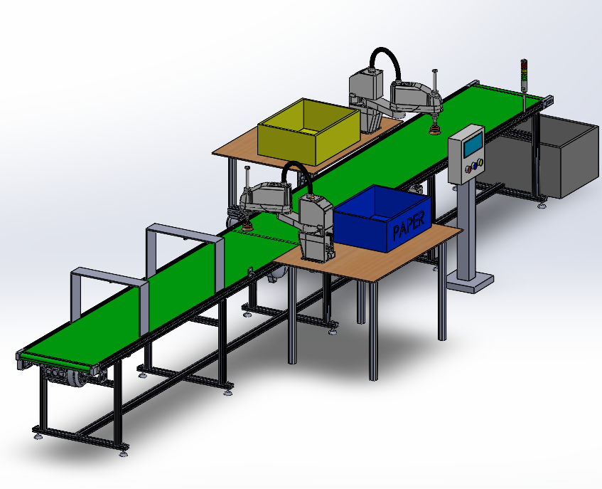

# Automated Waste Sorting System
## System Diagram


## Project Overview

The Automated Waste Sorting System is designed to automate the
identification and separation of different types of waste materials.
The system integrates a Raspberry Pi-based image processing system
with a Siemens S7-200 CPU 224 PLC, conveyor system, sensors,
robotic arms, and a vacuum suction mechanism.

The Raspberry Pi processes images captured by the camera and
determines the category of the waste material. The classification
result is communicated to the PLC, which coordinates the conveyor,
sensors, and robotic arms to perform the sorting operation.

## Main Components

- Raspberry Pi
- Camera
- Siemens S7-200 CPU 224 PLC
- Conveyor system
- Position detection sensors
- Epson T6-602S robotic arms
- Vacuum suction system
- Waste collection bins

## System Workflow

Camera  
↓  
Image Acquisition  
↓  
Image Processing  
↓  
Waste Classification  
↓  
Raspberry Pi  
↓  
PLC Communication  
↓  
Object Position Detection  
↓  
Robotic Arm  
↓  
Vacuum Pick-and-Place  
↓  
Waste Collection Bin

## Software and Technologies

- Python
- OpenCV
- Raspberry Pi OS
- PLC Programming
- Siemens S7-200
- Image Processing

## Project Structure

```text
Automated-Waste-Sorting-System
│
├── configuration/
│   └── config.py
│
├── image_processing/
│   └── classification.py
│
├── plc_control/
│   └── plc_communication.py
│
├── documentation/
│
├── main.py
├── requirements.txt
├── system_diagram.png
└── README.md
