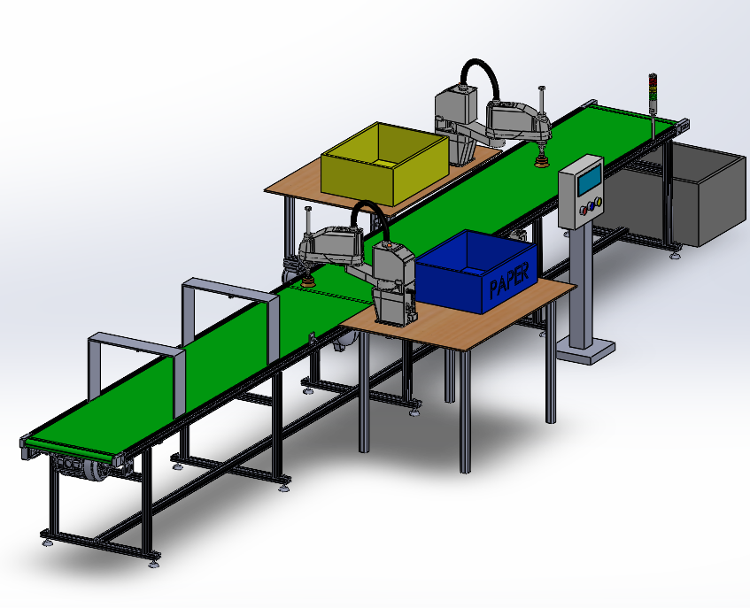

# Automated Waste Sorting System
## System Diagram


# Automated Waste Sorting System



## Project Overview

The Automated Waste Sorting System is designed to automate the identification and separation of different types of waste materials into Paper, Plastic, and Metal categories. The proposed system integrates a 230 V AC vibration feeder, conveyor system, Raspberry Pi-based image processing, a Siemens S7-200 CPU 224 PLC, photoelectric sensor, an Epson T6-602S SCARA robotic arm, and a vacuum suction mechanism.

The vibration feeder provides controlled feeding of waste materials onto the conveyor system. The Raspberry Pi camera captures images of the waste materials and the Raspberry Pi processes the images to classify each item. The classification result is transmitted to the PLC, which coordinates the conveyor movement, FIFO data storage, position detection, robotic operation, vacuum gripping, and sorting sequence.

A FIFO (First-In, First-Out) method is used to maintain the order of classified waste materials when multiple items are present in the conveyor system. When a waste item reaches the robotic pick position, the photoelectric sensor provides a detection signal to the PLC. The Epson T6-602S SCARA robotic arm then picks the waste using the vacuum suction cup and places it into the appropriate collection bin.

The PLC also maintains separate counters for the total number of sorted items and the quantities of Paper, Plastic, and Metal waste, allowing daily sorting records to be obtained.

## Main Components

- 230 V AC Vibration Feeder
- Raspberry Pi 4
- Raspberry Pi Camera Modules
- Arducam Multi-Camera Adapter V2.2
- Siemens S7-200 CPU 224 PLC
- Conveyor System
- Photoelectric Sensor
- Epson T6-602S SCARA Robotic Arm
- Vacuum Suction Cup
- Suction Valve
- Pneumatic Components
- Waste Collection Bins
- VFD / Motor Control System

## Waste Categories

- Paper
- Plastic
- Metal

## System Workflow

Vibration Feeder
↓
Conveyor 1
↓
Image Acquisition
↓
Image Processing
↓
Waste Classification
↓
Raspberry Pi
↓
PLC Classification Signal
↓
FIFO Queue
↓
Conveyor 2
↓
Photoelectric Sensor
↓
Epson T6-602S SCARA Robot
↓
Vacuum Pick-and-Place
↓
Paper / Plastic / Metal Collection Bin
↓
Counter Update
↓
Next Waste Item

## Classification Logic

| Classification Code | Waste Category | Collection Bin |
|---------------------|-----------------|----------------|
| 1 | Paper | Paper Bin |
| 2 | Plastic | Plastic Bin |
| 3 | Metal | Metal Bin |

## PLC Control

The Siemens S7-200 CPU 224 PLC is used as the main industrial control unit. The PLC performs:

- System Start/Stop control
- Vibration feeder control
- Conveyor control
- Classification signal processing
- FIFO queue management
- Photoelectric sensor monitoring
- Robotic sorting sequence control
- Vacuum control
- Timer control
- Total waste counting
- Paper counting
- Plastic counting
- Metal counting
- Counter reset and system reset

## Software and Technologies

- Python
- OpenCV
- Raspberry Pi OS
- Raspberry Pi Camera
- Image Processing
- Waste Classification
- Siemens STEP 7 Micro/WIN
- Siemens S7-200 PLC
- PLC Ladder Programming
- FIFO Data Handling
- SolidWorks

## Project Structure

```text
Automated-Waste-Sorting-System
│
├── configuration/
│   └── config.py
│
├── image_processing/
│   ├── image_processor.py
│   └── classification.py
│
├── plc_control/
│   └── plc_communication.py
│
├── documentation/
│
├── system_diagrams/
│   └── system_diagram.png
│
├── main.py
├── requirements.txt
└── README.md


Image Processing Workflow
Camera Image
     ↓
Image Resizing
     ↓
Grayscale Conversion
     ↓
Gaussian Filtering
     ↓
Otsu Thresholding
     ↓
Binary Image
     ↓
Contour Detection
     ↓
Object Region Extraction
     ↓
Feature Extraction
     ↓
Waste Classification
     ↓
Paper / Plastic / Metal
Data Recording

The PLC uses counters to record the number of sorted waste materials.

Total Waste Count
Paper Count
Plastic Count
Metal Count

The recorded values can be used to obtain the daily sorting quantity.

Project Status

This project focuses on the design and development of an automated waste-sorting system integrating mechanical, electrical, pneumatic, robotic, image-processing, and PLC-based control technologies
